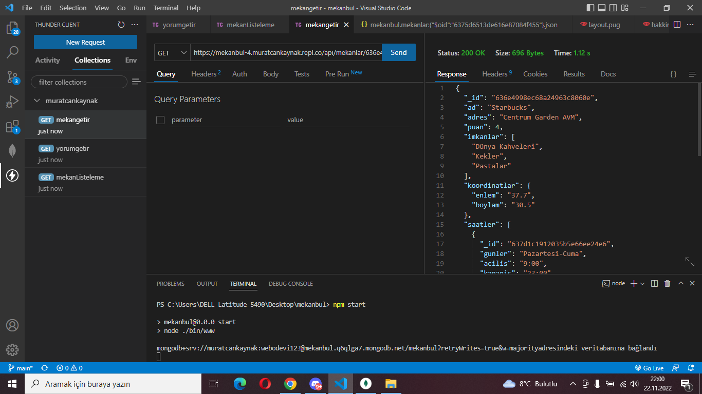
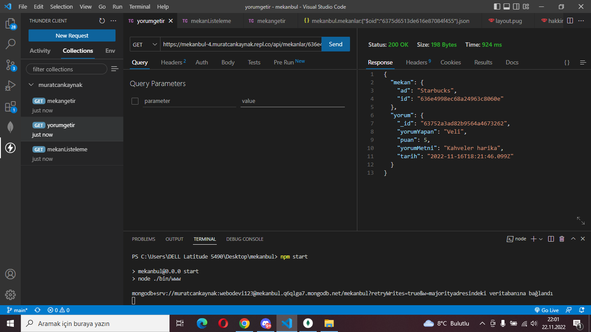
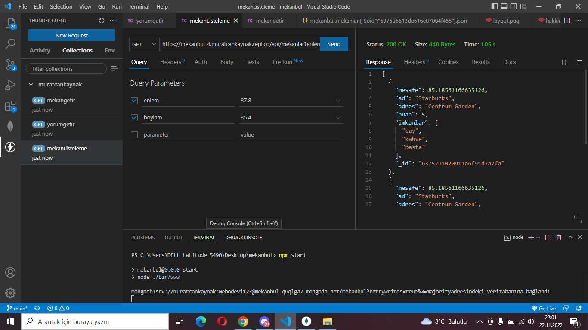

# Mekanbul REST API Adresleri
[1. Mekan ID ile Mekan Bilgileri Getir](https://mekanbul-4.muratcankaynak.repl.co/api/mekanlar/636e4998ec68a24963c8060e)

[2. Bir Mekana Ait Belirli Bir Yorumu Getir](https://mekanbul-4.muratcankaynak.repl.co/api/mekanlar/636e4998ec68a24963c8060e/yorumlar/63752a3ad82b9564a4673262)

[3.Girilen Konum Civarındaki Mekanları Listele](https://mekanbul-4.muratcankaynak.repl.co/api/mekanlar?enlem=37.8&boylam=35.4)

# Mekanbul REST API Adresleri
1.API Collections Test

2.API Mocha Test
